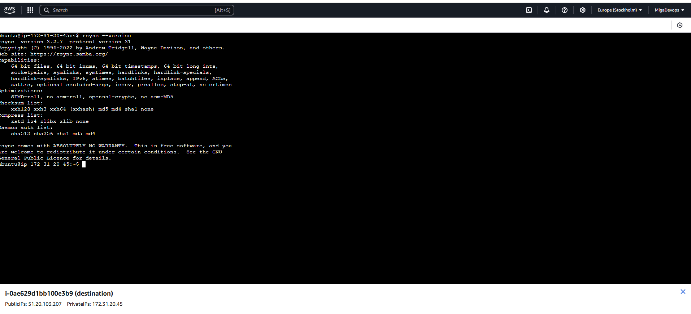

# Project-06
Creating Automated Backup System Using Rsync and Crontab 
## Project Overview:
In this project, we will develop an automated backup system that uses rsync to synchronize files and directories between two Ubuntu servers. One server will function as the source, hosting the files to be backed up, while the other will act as the destination, storing the backup copies. To ensure backups run regularly, we will schedule them using cron jobs.
## Prerequisites:
*   Two Ubuntu servers (source and destination)
*   SSH access to both servers
*   Basic knowledge of Linux command line

### Step-by-Step Implementation:
### Step 1 : Setup Source and Destination Servers on AWS.
*   Log in to your AWS Management Console.

*   Launch two Ubuntu EC2 instances (one for the source and one for the destination).


*   Connect to both servers via SSH.

*   Update and upgrade the package list and install rsync:
```
sudo apt update
```
```
sudo apt upgrade 
```
Press "Y" on the keyboard to upgrade packages
```
sudo apt install rsync
```
*   Check the installed version of rsync to confirm the installation:
```
rsync --version 
```
*   Source server

*   Destination server

### Step 2 : Configure SSH Key-Based Authentication:
To enable secure, password-less communication between the source and destination servers, configure SSH key-based authentication.

*   Generate an SSH key pair on the Source Server:
```
ssh-keygen -t rsa
```
Press ```Enter``` to accept the default key location ```(~/.ssh/id_rsa)```.

Leave the passphrase empty for automation.

*   Copy the Public Key to the Destination Server

Manually copy the public key:

*   Display the public key on the source server:
```
cat ~/.ssh/id_rsa.pub
```
*   Copy the displayed text (Public key)

*   On the Destination Server, add the copied key to the authorized_keys file:

Display current directory on destination server
```
pwd
```
Locate the authorized keys file on destination server
```
cd /home/ubuntu/.ssh
ls
```

Replace the content of the authorized key file with the public key
```
vi authorized_keys
```
Save and exit


*   Set the correct permissions for the authorized_keys file:
```
chmod 600 ~/.ssh/authorized_keys
```
*   Once the public key has been copied try connecting to the destination server using SSH from the source server:
```
ssh username@target_server_ip_address
```
If successful, you should be able to log in without a password.

* Exit the destination server on the source server
```
exit
```

### Step 3 : Create a Backup Script:
*   Create a sample file on the source server to be backed up on the destination server

```
vi file_name.txt
```

*   On the source server, create a backup script:
```
vi backup.sh
```
*   Add the Following Script:
Replace the placeholders with your actual paths and server details
```
#!/bin/bash

set -ex  # Exit on errors and print commands

# Define source and destination directories
SRC_DIR="/path/to/source"
DEST_HOST="ubuntu@destination_server_ip"
DEST_DIR="/path/to/destination"

# Rsync command to synchronize files and directories
rsync -avz "$SRC_DIR" "$DEST_HOST:$DEST_DIR"

echo "Backup completed successfully."
```
*   Save the script and exit.

*   Make the script executable:
```
chmod +x backup.sh
```
### Step-4 : Schedule Backup with Cron:
*   Edit the crontab file to schedule regular backups:
```
crontab -e
```
*   Add a cron job to execute the backup script at the desired interval. for every 2hours:
```
0 */2 * * * /path/to/backup.sh
```


*   List the cron jobs to confirm the backup job is scheduled:
```
crontab -l
```


### Conclusion
In this project, you learned how to:

✅ Set up an automated backup system using rsync.

✅ Configure SSH key-based authentication for secure access.

✅ Use cron jobs to schedule periodic backups.

Project Completed!🎉